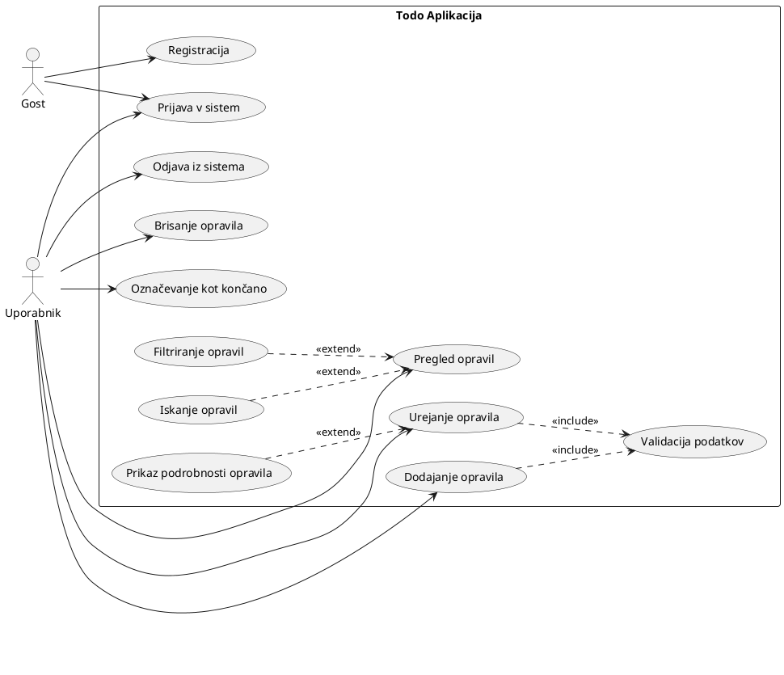

<h1>Todo Aplikacija</h1>
Celostna aplikacija za upravljanje opravil z Java Spring Boot backend-om in React frontend-om.
<hr>

<h2>🎯 Vizija projekta</h2>
<p>
<strong>Namen:</strong> Todo aplikacija je namenjena vsem, ki želijo povečati svojo produktivnost in učinkovito organizirati vsakodnevna opravila. Aplikacija je zasnovana za študente, profesionalce in posameznike, ki potrebujejo pregleden in enostaven sistem za upravljanje nalog.
</p>
<p>
<strong>Cilj:</strong> Naš cilj je ustvariti intuitivno, zanesljivo in dostopno spletno aplikacijo, ki uporabnikom omogoča hitro dodajanje, urejanje, brisanje in pregledovanje opravil. S tem želimo odpraviti težave, povezane z neorganiziranostjo, pozabljenimi nalogami in pomanjkanjem učinkovitih orodij za načrtovanje dela.
</p>
<p>
<strong>Vrednost:</strong> Aplikacija izboljša uporabniško izkušnjo z enostavnim vmesnikom, hitrim odzivom in možnostjo dostopa od kjerkoli preko spletnega brskalnika. Z jasno strukturo in preglednim prikazom nalog uporabnikom omogoča boljše upravljanje časa in večjo produktivnost pri vsakodnevnih opravilih.
</p>
<hr>

<h2>📖 Besednjak</h2>
<table>
  <thead>
    <tr>
      <th>Izraz</th>
      <th>Razlaga</th>
    </tr>
  </thead>
  <tbody>
    <tr>
      <td><strong>Opravilo (Task)</strong></td>
      <td>Osnovna enota aplikacije - naloga ali aktivnost, ki jo uporabnik želi izpolniti. Vsebuje naziv, opis in status.</td>
    </tr>
    <tr>
      <td><strong>Assigned users</strong></td>
      <td>Vsi uporabniki, dodeljeni enem opravilu</td>
    </tr>
    <tr>
      <td><strong>Backend</strong></td>
      <td>Strežniška stran aplikacije, napisana v Java Spring Boot, ki upravlja poslovno logiko, dostop do podatkov in REST API.</td>
    </tr>
    <tr>
      <td><strong>Frontend</strong></td>
      <td>Uporabniški vmesnik aplikacije, razvit v React, ki prikazuje opravila in omogoča interakcijo z uporabnikom.</td>
    </tr>
    <tr>
      <td><strong>REST API</strong></td>
      <td>Aplikacijski vmesnik za komunikacijo med frontend-om in backend-om preko HTTP protokola (GET, POST, PUT, DELETE).</td>
    </tr>
    <tr>
      <td><strong>Controller</strong></td>
      <td>Komponenta v backend-u, ki sprejema HTTP zahteve in vrača odgovore. Primer: <code>TaskController.java</code>.</td>
    </tr>
    <tr>
      <td><strong>Repository (DAO)</strong></td>
      <td>Sloj za dostop do podatkov (Data Access Object), ki omogoča operacije CRUD nad bazo podatkov.</td>
    </tr>
    <tr>
      <td><strong>MySQL</strong></td>
      <td>Relacijska podatkovna baza, uporabljena za trajno shranjevanje opravil v produkcijskem okolju.</td>
    </tr>
    <tr>
      <td><strong>CRUD operacije</strong></td>
      <td>Osnovne operacije nad podatki: Create (ustvari), Read (preberi), Update (posodobi), Delete (izbriši).</td>
    </tr>
  </tbody>
</table>
<hr>

<h2>📊 Diagram primerov uporabe</h2>
<p>
Spodnji diagram prikazuje glavne funkcionalnosti aplikacije in interakcije med uporabniki ter sistemom. Diagram vključuje dva akterja (Gost in Uporabnik) ter vse ključne primere uporabe aplikacije.
</p>



<p><strong>Legenda:</strong></p>
<ul>
  <li><strong>Gost:</strong> Neregistriran obiskovalec, ki se lahko registrira ali prijavi v sistem</li>
  <li><strong>Uporabnik:</strong> Prijavljen uporabnik z dostopom do vseh funkcionalnosti aplikacije</li>
  <li><strong>Include (<<include>>):</strong> Validacija podatkov je obvezni del dodajanja in urejanja opravil</li>
  <li><strong>Extend (<<extend>>):</strong> Filtriranje, iskanje in prikaz podrobnosti so opcijske razširitve osnovnih funkcionalnosti</li>
</ul>

<p><strong>Glavni primeri uporabe:</strong></p>
<ol>
  <li><strong>Registracija</strong> - Gost ustvari nov uporabniški račun</li>
  <li><strong>Prijava v sistem</strong> - Avtentikacija uporabnika za dostop do aplikacije</li>
  <li><strong>Odjava iz sistema</strong> - Uporabnik se varno odjavi iz aplikacije</li>
  <li><strong>Pregled opravil</strong> - Prikaz seznama vseh uporabnikovih opravil</li>
  <li><strong>Dodajanje opravila</strong> - Ustvarjanje novega opravila z validacijo podatkov</li>
  <li><strong>Urejanje opravila</strong> - Posodabljanje obstoječega opravila z validacijo podatkov</li>
  <li><strong>Brisanje opravila</strong> - Odstranitev opravila iz sistema</li>
  <li><strong>Označevanje kot končano</strong> - Sprememba statusa opravila na končano</li>
  <li><strong>Filtriranje opravil</strong> - Opcijsko filtriranje seznama po statusu ali drugih kriterijih</li>
  <li><strong>Iskanje opravil</strong> - Opcijsko iskanje po ključnih besedah</li>
</ol>
<hr>

<h2>⚙️ Tehnologije in orodja</h2>

<h3>Frontend</h3>
<ul>
  <li><strong>Jezik:</strong> JavaScript (ES6+), JSX</li>
  <li><strong>Okvir (framework):</strong> React <code>^19.2.0</code></li>
  <li><strong>Router:</strong> React Router DOM <code>^7.9.4</code></li>
  <li><strong>HTTP odjemalec:</strong> Axios <code>^1.12.2</code></li>
  <li><strong>UI knjižnice:</strong>
    <ul>
      <li>Material UI (<code>@mui/material</code> <code>^7.3.4</code>)</li>
      <li>Material Icons (<code>@mui/icons-material</code> <code>^7.3.4</code>)</li>
      <li>Emotion (<code>@emotion/react</code> <code>^11.14.0</code>)</li>
      <li>Bootstrap <code>^5.3.8</code></li>
    </ul>
  </li>
  <li><strong>Testiranje:</strong>
    <ul>
      <li>@testing-library/react <code>^16.3.0</code></li>
      <li>@testing-library/jest-dom <code>^6.9.1</code></li>
      <li>@testing-library/user-event <code>^13.5.0</code></li>
      <li>@testing-library/dom <code>^10.4.1</code></li>
      <li>web-vitals <code>^2.1.4</code></li>
    </ul>
  </li>
</ul>

<h3>Backend</h3>
<ul>
  <li><strong>Jezik:</strong> Java <code>21</code></li>
  <li><strong>Okvir (framework):</strong> Spring Boot <code>3.5.7</code></li>
  <li><strong>Knjižnice:</strong>
    <ul>
      <li>spring-boot-starter-web – REST API</li>
      <li>spring-boot-starter-data-jpa – JPA/Hibernate ORM</li>
      <li>com.h2database:h2 – spominska baza za razvoj</li>
      <li>com.mysql:mysql-connector-j – povezava z MySQL</li>
      <li>org.projectlombok:lombok – avtomatizacija getterjev/setterjev</li>
      <li>spring-boot-starter-test – testiranje</li>
    </ul>
  </li>
  <li><strong>Gradnik projekta:</strong> Apache Maven</li>
  <li><strong>IDE priporočila:</strong> IntelliJ IDEA, VS Code, Eclipse</li>
  <li><strong>Verzijski nadzor:</strong> Git + GitHub</li>
</ul>

<hr>

<h2>🧩 Projektna struktura (logika)</h2>

<table>
  <thead>
    <tr>
      <th>Sloj</th>
      <th>Opis</th>
    </tr>
  </thead>
  <tbody>
    <tr>
      <td><strong>Model (models)</strong></td>
      <td>JPA entitete, npr. <code>Task.java</code></td>
    </tr>
    <tr>
      <td><strong>DAO (dao)</strong></td>
      <td>Repository vmesniki za dostop do baze (<code>TaskRepository</code>)</td>
    </tr>
    <tr>
      <td><strong>Controller (controllers)</strong></td>
      <td>REST API endpointi (<code>TaskController</code>)</td>
    </tr>
    <tr>
      <td><strong>Frontend Components</strong></td>
      <td>UI komponente – prikaz nalog, obrazci, navigacija</td>
    </tr>
    <tr>
      <td><strong>Services (frontend)</strong></td>
      <td><code>axios</code> funkcije za komunikacijo z backendom</td>
    </tr>
  </tbody>
</table>

<h2>📁 Struktura projekta</h2>

<pre>
RISPROJEKT/
├─ backend/
│  └─ tasklist/
│     ├─ src/
│     │  ├─ main/
│     │  │  ├─ java/com/example/tasklist/
│     │  │  │  ├─ controllers/        # REST kontrolerji (TaskController)
│     │  │  │  ├─ dao/                # Dostop do baze (TaskRepository)
│     │  │  │  ├─ models/             # JPA entitete (Task)
│     │  │  │  └─ TasklistApplication.java  # Glavni Spring Boot razred
│     │  │  └─ resources/
│     │  │     └─ application.properties   # Nastavitve baze, port itd.
│     │  └─ test/
│     │     └─ java/com/example/tasklist/TasklistApplicationTests.java
│     ├─ pom.xml
│     └─ (ostale Maven datoteke)
│
└─ frontend/
   ├─ public/
   │  ├─ index.html
   │  ├─ favicon.ico
   │  ├─ manifest.json
   │  └─ robots.txt
   ├─ src/
   │  ├─ components/
   │  │  ├─ Landing/        # začetna stran
   │  │  ├─ Navbar/         # navigacijska vrstica
   │  │  ├─ PageNotFound/   # 404 stran
   │  │  └─ Tasks/          # komponenta za seznam opravil
   │  ├─ routing/           # usmerjanje (Routing.js)
   │  ├─ services/          # klici na backend (axios)
   │  ├─ App.js             # glavna React komponenta
   │  ├─ index.js           # vstopna točka aplikacije
   │  └─ (ostale datoteke)
   ├─ package.json
   ├─ .env
   └─ README.md
</pre>

<hr>

<h2>🛠️ Uporabljena orodja in verzije</h2>

<ul>
  <li><strong>Node.js:</strong> 22.x ali novejši</li>
  <li><strong>npm:</strong> 10.x ali novejši</li>
  <li><strong>Java Development Kit (JDK):</strong> 21</li>
  <li><strong>Spring Boot CLI:</strong> 3.5.7</li>
  <li><strong>Maven:</strong> 3.9.x</li>
  <li><strong>MySQL Server:</strong> 8.0+</li>
  <li><strong>Git:</strong> 2.43+ (za verzioniranje kode)</li>
  <li><strong>IDE:</strong> IntelliJ IDEA / VS Code</li>
  <li><strong>Browser:</strong> Chrome / Firefox (za razvoj in testiranje frontenda)</li>
</ul>

<hr>

<h2>🧱 Standardi kodiranja</h2>

<h3>Frontend (React)</h3>
<ul>
  <li>Komponente: <code>PascalCase</code> (npr. <code>TaskList</code>, <code>Navbar</code>)</li>
  <li>Spremenljivke/funkcije: <code>camelCase</code></li>
  <li>Ena komponenta na datoteko (<code>Component.js</code>, <code>Component.css</code>)</li>
  <li>ESLint ("react-app") + priporočljivo Prettier formatiranje</li>
</ul>

<h3>Backend (Java)</h3>
<ul>
  <li>Razredi: <code>PascalCase</code>, metode/spremenljivke <code>camelCase</code></li>
  <li>Paketi: <code>lowercase</code></li>
  <li>REST endpointi po konvenciji <code>/api/...</code></li>
  <li>Uporabi <code>@RestController</code>, <code>@Service</code>, <code>@Repository</code>, <code>@Entity</code></li>
</ul>

<hr>

<h2>▶️Navodila za nameščanje in zagon (za uporabnika brez ničesar nameščenega)</h2>
<h2>Kratek uvod</h2>
Ta projekt vsebuje dve ločeni aplikaciji: backend (Spring Boot, Java) v tasklist in frontend (React) v frontend. Backend po privzetih nastavitvah pričakuje MySQL bazo, vendar je na voljo tudi hiter način z uporabo vgrajene H2 baze (navodila spodaj). Backend teče na privzetem portu 8080; frontend v razvoju na 3000.
<ol>
    <li><strong>Predpogoji (kaj namestiti)</strong></li>
    <ul>
        <li>Java JDK 21 (npr. Eclipse Temurin / Adoptium ali Oracle/OpenJDK). Prenesi z: https://www.oracle.com/java/technologies/downloads/#java21 (izberi JDK 21).</li>
        <li>Git (opcijsko, če želiš klonirati repozitorij): https://git-scm.com</li>
        <li>(Neobvezno) MySQL Workbench, če želiš zagnati aplikacijo z MySQL podatkovno bazo: https://dev.mysql.com/downloads/workbench/</li>
        <li>Node.js (vključuje npm) — priporočam LTS (npr. 18 ali 20): https://nodejs.org</li>
        <li>(Ni potreben) Maven — v projektu je Maven Wrapper (mvnw / mvnw.cmd), zato ni nujno da nameščaš Maven globalno.</li>
    </ul>
    <li><strong>Priprava podatkovne baze</strong></li>
    <ul>
        <li>
            Koraki za hitro vzpostavitev lokalne MySQL baze z uporabo MySQL Workbench:
            <ol>
                <li>Zaženi MySQL Server in odpri MySQL Workbench. Poveži se na lokalni instance (host: <code>localhost</code>, port: <code>3306</code>) z uporabnikom <code>root</code>.</li>
                <li>Odpri novo SQL okno (SQL Editor) in zaženi naslednje ukaze, da ustvariš bazo in namenski uporabnik (zamenjaj geslo z močnim geslom):
                    ```sql
                    CREATE DATABASE IF NOT EXISTS `toDoList` CHARACTER SET utf8mb4 COLLATE utf8mb4_unicode_ci;
                    CREATE USER IF NOT EXISTS 'taskuser'@'localhost' IDENTIFIED BY 'MojeVarnoGeslo123!';
                    GRANT ALL PRIVILEGES ON `toDoList`.* TO 'taskuser'@'localhost';
                    FLUSH PRIVILEGES;
                    ```
                </li>
                <li>Osveži panel <strong>Schemas</strong> v Workbenchu in preveri, da se pojavi shema <code>toDoList</code>.</li>
                <li>Posodobi konekcijske podatke v <code>backend/tasklist/src/main/resources/application.properties</code> tako, da uporabljaš novega uporabnika:
                    ```properties
                    spring.datasource.url=jdbc:mysql://localhost:3306/toDoList?useSSL=false&allowPublicKeyRetrieval=true&serverTimezone=UTC
                    spring.datasource.username=taskuser
                    spring.datasource.password=MojeVarnoGeslo123!
                    ```
                </li>
            </ol>
        </li>
    </ul>
    <li><strong>Zagon backenda</strong></li>
        <ul>
            <li>Odpri cmd.exe in se preko cd ukazov pomakni v <code>.../tasklist/backend/tasklist mapo</code></li>
            <li>Napiši ukaz <strong>mvnw spring-boot:run</strong></li>
            <li>S tem si zagnal zaledje aplikacije</li>
        </ul>
    <li>Zagon frontenda</li>
        <ul>
            <li>Odpri nov cmd.exe in se pomakni v .../tasklist/frontend mapo</li>
            <li>Napiši ukaz <strong> npm start </strong>
            <li>S tem si zagnal obličje aplikacije, in dokončal zagon.</li>
        </ul>
</ol>

<hr>

<h2>🤝 Navodila za prispevanje</h2>

<ol>
  <li><strong>Fork</strong>-aj repozitorij</li>
  <li>Ustvari novo vejo:
    <pre>git checkout -b feature/ime-funkcionalnosti</pre>
  </li>
  <li>Naredi spremembe in commitaj:
    <pre>git commit -m "feat: dodan filter po statusu nalog"</pre>
  </li>
  <li>Pushaj in odpri <strong>Pull Request</strong>.</li>
</ol>

<h3>Pravila</h3>
<ul>
  <li>Jasna commit sporočila (<code>feat:</code>, <code>fix:</code>, <code>refactor:</code>)</li>
  <li>Preveri, da se aplikacija zažene brez napak</li>
  <li>Ne puščaj nepotrebnih komentarjev in datotek</li>
</ul>

<hr>

<h2>📬 Kontakt</h2>
<ul>
  <li><strong>Avtorji:</strong> Lenart Beršnak in Gašper Kavčič</li>
  <li><strong>Repozitorij:</strong> https://github.com/bersnakovec/risprojekt</li>
  <li><strong>Težave/ideje:</strong> odpri <em>Issue</em> ali <em>Pull Request</em></li>
</ul>
